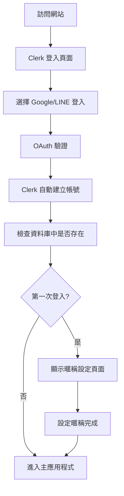
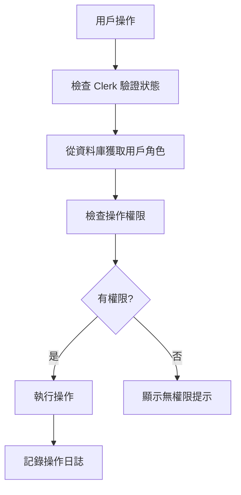

# Clerk 身份驗證 + 自定義權限系統設計

## 🔧 技術架構

### 身份驗證層 (Clerk)
- **OAuth 提供商**: Google, LINE
- **註冊模式**: 自動註冊（無手動註冊介面）
- **會話管理**: Clerk 自動處理

### 權限管理層 (自定義資料庫)
- **用戶資料**: 儲存在自己的資料庫
- **權限控制**: 彈性的角色權限系統
- **審計日誌**: 記錄所有重要操作

---

## 📦 安裝和配置

### 1. 安裝 Clerk
```bash
npm install @clerk/nextjs
```

### 2. 環境變數設定
```env
# .env.local
NEXT_PUBLIC_CLERK_PUBLISHABLE_KEY=pk_test_...
CLERK_SECRET_KEY=sk_test_...
NEXT_PUBLIC_CLERK_SIGN_IN_URL=/sign-in
NEXT_PUBLIC_CLERK_SIGN_UP_URL=/sign-up
NEXT_PUBLIC_CLERK_AFTER_SIGN_IN_URL=/
NEXT_PUBLIC_CLERK_AFTER_SIGN_UP_URL=/onboarding
```

### 3. Clerk Dashboard 設定
- 啟用 Google OAuth
- 啟用 LINE OAuth  
- 停用 Email/密碼註冊
- 設定自動註冊模式

---

## 🗃️ 資料庫架構設計

### Users 表格
```sql
CREATE TABLE users (
  id UUID PRIMARY KEY DEFAULT gen_random_uuid(),
  clerk_id VARCHAR(255) UNIQUE NOT NULL,
  email VARCHAR(255) NOT NULL,
  nickname VARCHAR(100),
  avatar_url TEXT,
  role ENUM('admin', 'staff', 'volunteer') DEFAULT 'volunteer',
  is_first_login BOOLEAN DEFAULT true,
  created_at TIMESTAMP DEFAULT CURRENT_TIMESTAMP,
  updated_at TIMESTAMP DEFAULT CURRENT_TIMESTAMP,
  last_login_at TIMESTAMP
);
```

### Activity_Logs 表格（審計日誌）
```sql
CREATE TABLE activity_logs (
  id UUID PRIMARY KEY DEFAULT gen_random_uuid(),
  user_id UUID REFERENCES users(id),
  action VARCHAR(100) NOT NULL,
  resource_type VARCHAR(50),
  resource_id VARCHAR(100),
  details JSONB,
  ip_address INET,
  user_agent TEXT,
  created_at TIMESTAMP DEFAULT CURRENT_TIMESTAMP
);
```

---

## 🔄 用戶流程設計

### 首次登入流程


### 權限檢查流程


---

## 🎯 組件架構

### 1. 認證相關組件
```
/src/components/auth/
├── AuthGuard.tsx          # 路由保護
├── OnboardingFlow.tsx     # 首次登入設定
├── UserProfile.tsx        # 用戶資料編輯
└── SignInPage.tsx         # 登入頁面
```

### 2. 權限管理組件
```
/src/components/admin/
├── StaffManagement.tsx    # 人員管理主頁面
├── UserList.tsx          # 用戶列表
├── UserEditModal.tsx     # 編輯用戶權限
└── ActivityLog.tsx       # 操作日誌
```

### 3. 權限檢查 Hooks
```
/src/hooks/
├── useAuth.ts            # 用戶認證狀態
├── usePermissions.ts     # 權限檢查
└── useActivityLog.ts     # 操作日誌記錄
```

---

## 📋 實作計劃

### 階段一：基礎認證
- [ ] 安裝和配置 Clerk
- [ ] 設定 OAuth 提供商
- [ ] 建立資料庫表格
- [ ] 實作用戶同步機制

### 階段二：首次登入流程
- [ ] 建立 Onboarding 頁面
- [ ] 實作暱稱設定功能
- [ ] 處理首次登入邏輯

### 階段三：人員管理
- [ ] 建立人員管理頁面
- [ ] 實作權限編輯功能
- [ ] 新增管理員導航選項

### 階段四：權限整合
- [ ] 重構現有組件加入權限檢查
- [ ] 實作操作日誌記錄
- [ ] 測試完整流程

---

## 🔒 安全考量

### 1. 權限驗證
- 前端權限檢查（UX）+ 後端權限驗證（安全）
- 每個 API 端點都要檢查用戶權限
- 敏感操作需要二次確認

### 2. 資料保護
- 用戶個人資訊加密儲存
- API 請求需要 CSRF 保護
- 定期清理過期會話

### 3. 審計追蹤
- 記錄所有權限變更
- 監控異常登入行為
- 定期檢查操作日誌

---

## 🎨 UI/UX 設計

### 登入頁面設計
```tsx
// 簡潔的登入介面，只顯示 OAuth 按鈕
<div className="flex flex-col gap-4">
  <Button variant="outline" size="lg">
    <GoogleIcon /> 使用 Google 登入
  </Button>
  <Button variant="outline" size="lg">
    <LineIcon /> 使用 LINE 登入
  </Button>
</div>
```

### 人員管理介面設計
```tsx
// 表格式的用戶管理介面
<Table>
  <TableHeader>
    <TableRow>
      <TableHead>用戶</TableHead>
      <TableHead>暱稱</TableHead>
      <TableHead>角色</TableHead>
      <TableHead>最後登入</TableHead>
      <TableHead>操作</TableHead>
    </TableRow>
  </TableHeader>
  <TableBody>
    {users.map(user => (
      <UserRow key={user.id} user={user} />
    ))}
  </TableBody>
</Table>
```

*準備開始實作？*